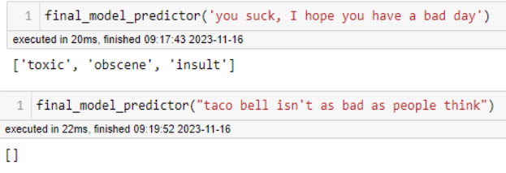

# Toxic-Comment-Classification-Challenge

# Overview
The goal for this project was to identify different forms of toxicity in an attempt to filter them out of users' feeds to help promote a more wholesome online environment. I hope that by removing negativity from feeds it will reduce the amount of interaction they receive and help uplifting content gain traction and in turn, incentivize social media users to be more positive.
To accomplish this goal I will be using different machine learning models such as: Logistic Regression, Multinomial Naive Bayes, Random Forest Classifier, and Convolutional Neural Networks.

# Understanding of Social Media

## The good
While social media does get a bad rap there are positives that come out of it. Such as giving an audience to underrepresented populations and giving a voice to those who would typicallly struggled to find one. You’ll also often see support given in donations or fundraisers run through social media such as the 2.6 million dollar raised for those affected by the maui wildfires through instagram. It’s also a speedy low commitment way of communicating, tweets take on average only 1-2 minutes to write while usually I’ll only get through my hellos in a phone call in 1-2 minutes.

## The bad
There are of course the negative aspects, mostly dealing with emotional health. 
A [study](https://www.sciencedaily.com/releases/2019/03/190315110908.htm) conducted in 2019 showed a 52% increase from 8.7 to 13.2% in adolescents and a 63% increase from 8.1 to 13.2% in young adults of symptoms consistent with major depression. Also in another [study](https://childmind.org/article/is-social-media-use-causing-depression/) from 2017 they found Boys’ depression increased by 21% between 2012 and 2015, and girls’ increased by 50%.

# Data
To combat this problem I obtained data from a toxic text classification competition hosted by [kaggle](https://www.kaggle.com/competitions/jigsaw-toxic-comment-classification-challenge/data).
The comment_text was taken from wikipedia comments that were then manually judged as toxic, severe_toxic, obscene, threats, insults, and identity hate. My target for my predictions was to find an accurate model that also kept the amount of false negatives to a minimum also known as the recall rate. This is to prioritize not allowing toxic comments through.

# Model
The best model I found was a logistic regression model that had a recall rate around 80-85% and an accuracy of 87%, this means 80-85% of the toxic comments were identified correctly by this model. Here are two examples, one is mean, the other is an opinion that some may not agree with but is not being flagged as toxic. 

# Conclusion

While the model performs much better than the baseline, there is still a lot of room for improvement. My next steps are to gather more toxic data as currently it makes up only around 10% of the total dataset. I would like to also further improve the model by playing around with different hyperparameters. I also want to create a sensitivity slider that would allow more or less toxic comments through, based on an individual's preferences as well as specific models for different social media platforms and perhaps different video games as well. Next I would like to release the models as perhaps a google extension and hopefully increase positivity in the world 😀
